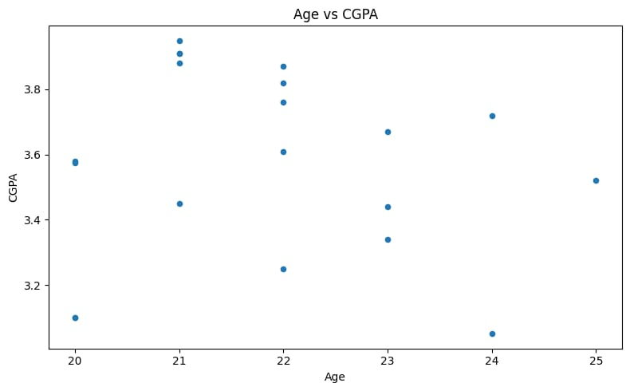
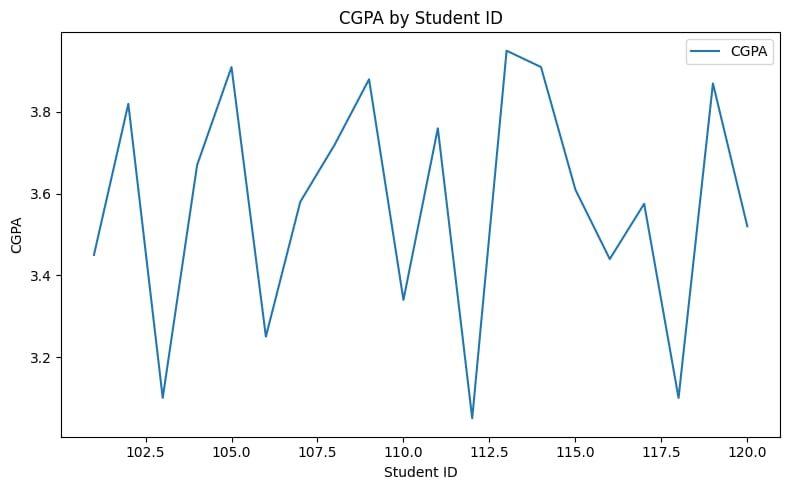
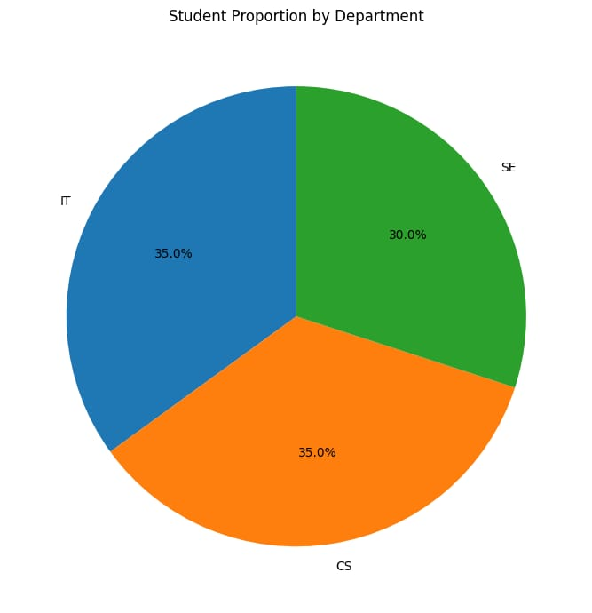
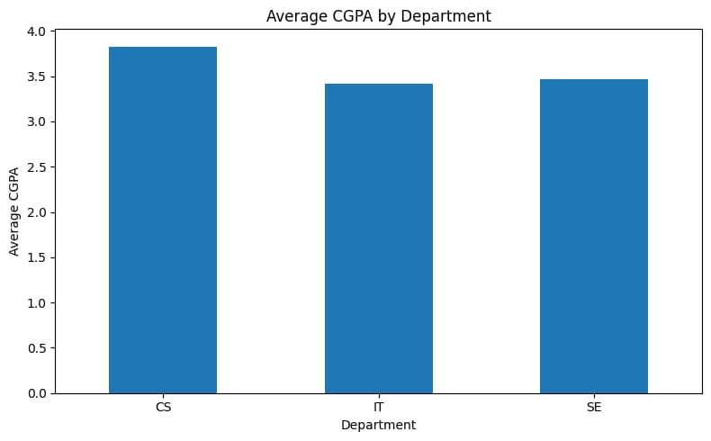

# 🐍 Python Student Analysis

A beginner-to-intermediate Python data analysis project created as part of my **Python and Data Analysis learning journey**.

This project focuses mainly on **Pandas**, with basic **Matplotlib visualization**, using a student dataset to practice data cleaning, filtering, grouping, aggregation, sorting, calculations, and visualization.

The purpose of this repository is not only to complete a project, but also to create a **personal reference repository** that I can return to whenever I forget a Python/Pandas concept.

---

## 📌 Project Overview

The project analyzes student information such as:

* Student ID
* Name
* Department
* Age
* CGPA
* City

The dataset is cleaned and analyzed using Python and Pandas. Different operations are then performed to extract useful information and create visualizations.

---

## 📂 Project Structure

```text
Python-student-analysis/
│
├── README.md
├── LICENSE
├── .gitignore
├── requirements.txt
├── main.py
│
├── data/
│   └── students.csv
│
└── output/
    ├── age_vs_cgpa.png
    ├── average_cgpa_by_department.png
    ├── cgpa_line_chart.png
    └── department_proportion.png
```

### 🔗 Quick Access

* 🐍 [Main Python Script](main.py)
* 📊 [Student Dataset](data/students.csv)
* 📦 [Requirements](requirements.txt)
* 📈 [Age vs CGPA](output/age_vs_cgpa.png)
* 📉 [CGPA by Student ID](output/cgpa_line_chart.png)
* 🥧 [Student Proportion by Department](output/department_proportion.png)
* 📊 [Average CGPA by Department](output/average_cgpa_by_department.png)

---

# 📚 Topics Covered

This project covers the major Pandas concepts I have studied so far.

## 🐼 Pandas Fundamentals

* Importing Pandas
* Reading CSV files using `pd.read_csv()`
* `head()`
* `tail()`
* `sample()`
* `describe()`
* `shape`
* `columns`
* `dtypes`
* `index`
* `info()`

## 🧹 Data Cleaning

* Detecting missing values
* `isnull()`
* `isnull().sum()`
* `value_counts()`
* Detecting duplicate rows
* `duplicated()`
* Removing duplicates using `drop_duplicates()`
* Converting data types using `pd.to_numeric()`
* Using `errors="coerce"`
* Converting dates using `pd.to_datetime()`
* Handling missing values with `fillna()`
* Filling missing values using the column mean

## 🔎 Filtering

Boolean filtering is used to find specific students based on conditions.

Examples include:

```python
df[df["CGPA"] > 3.50]
```

and multiple conditions:

```python
df[(df["City"] == "Lahore") & (df["CGPA"] > 3.00)]
```

## 📊 GroupBy

The project practices:

```python
df.groupby()
```

along with aggregation functions such as:

* `mean()`
* `max()`
* `min()`
* `sum()`
* `count()`

Example:

```python
df.groupby("Department")["CGPA"].mean()
```

## 📋 Aggregation

The project also uses:

```python
df.groupby("Department").agg({
    "CGPA": "mean",
    "Age": "max"
})
```

This allows multiple calculations to be performed for different columns.

## 🏆 Finding Maximum / Minimum Groups

The project uses:

```python
idxmax()
```

and:

```python
idxmin()
```

to identify which group has the highest or lowest value.

## 🔢 Indexing and Selection

The project practices:

* `loc[]`
* `iloc[]`
* `idxmax()`
* `idxmin()`
* `index.get_loc()`

## 📈 Calculated Columns

New columns are created from existing data.

Example:

```python
df["Average_Value"] = df["Total"] / df["Count"]
```

## 🔃 Sorting

The project uses:

```python
df.sort_values()
```

including descending order:

```python
df.sort_values(by="CGPA", ascending=False)
```

## ⚙️ Apply Function

Custom functions are applied to entire columns using:

```python
df["Category"] = df["CGPA"].apply(my_function)
```

This was practiced for creating categories based on numerical values.

## 💾 Exporting Data

The cleaned dataset can be exported using:

```python
df.to_csv("cleaned_data.csv", index=False)
```

---

# 📊 Matplotlib Visualization

Basic Matplotlib/Pandas plotting is also included.

The project contains:

### 📈 Scatter Plot

**Age vs CGPA**

[View Age vs CGPA](output/age_vs_cgpa.png)

### 📉 Line Chart

**CGPA by Student ID**

[View CGPA Line Chart](output/cgpa_line_chart.png)

### 🥧 Pie Chart

**Student Proportion by Department**

[View Department Proportion](output/department_proportion.png)

### 📊 Bar Chart

**Average CGPA by Department**

[View Average CGPA Chart](output/average_cgpa_by_department.png)

---

# 🛠️ Technologies Used

| Technology      | Purpose                              |
| --------------- | ------------------------------------ |
| 🐍 Python       | Programming language                 |
| 🐼 Pandas       | Data manipulation and analysis       |
| 📊 Matplotlib   | Data visualization                   |
| 📄 CSV          | Dataset format                       |
| ☁️ Google Colab | Development and practice environment |
| 🐙 GitHub       | Version control and project storage  |

---

# ⚙️ Installation

Clone the repository:

```bash
git clone https://github.com/AbdullahButt18/Python-student-analysis.git
```

Move into the project directory:

```bash
cd Python-student-analysis
```

Install the required libraries:

```bash
pip install -r requirements.txt
```

---

# ▶️ Running the Project

Run the Python script:

```bash
python main.py
```

The script reads the dataset from:

```text
data/students.csv
```

and performs the analysis and visualization operations.

---

# 🧠 Learning Process

This repository represents my practical learning process rather than just a finished project.

The learning progression was:

```text
Python Basics
      ↓
Pandas Fundamentals
      ↓
Data Cleaning
      ↓
Filtering
      ↓
GroupBy
      ↓
Aggregation
      ↓
Indexing
      ↓
Sorting
      ↓
Calculated Columns
      ↓
Apply Function
      ↓
Matplotlib Basics
      ↓
Machine Learning
```

The main goal is to understand **why and when** each operation is used instead of simply memorizing syntax.

---

# 🎯 Purpose of This Repository

This repository serves two purposes:

### 1. Practice

It demonstrates my practical understanding of Python and Pandas through a complete dataset analysis workflow.

### 2. Personal Reference

If I forget a Pandas concept in the future, I can return to this repository and quickly review:

* Syntax
* Examples
* Data cleaning techniques
* Filtering
* GroupBy
* Aggregation
* Indexing
* Sorting
* Apply functions
* Visualization

---

# 🚀 Future Learning Path

After completing the Pandas fundamentals, my planned learning path is:

```text
Pandas
  ↓
Matplotlib
  ↓
NumPy
  ↓
Statistics
  ↓
Scikit-learn
  ↓
Classical Machine Learning
  ↓
Advanced Machine Learning
  ↓
Generative AI
  ↓
AI Engineering
```

The immediate next focus is **Matplotlib**, followed by the mathematical and machine learning foundations required to build machine learning models independently.

---

# 📌 Current Status

| Area                | Status      |
| ------------------- | ----------- |
| Python Basics       | ✅ Completed |
| Pandas Fundamentals | ✅ Practiced |
| Data Cleaning       | ✅ Practiced |
| Filtering           | ✅ Practiced |
| GroupBy             | ✅ Practiced |
| Aggregation         | ✅ Practiced |
| Sorting             | ✅ Practiced |
| Indexing            | ✅ Practiced |
| Apply Function      | ✅ Practiced |
| CSV Handling        | ✅ Practiced |
| Basic Matplotlib    | 🔄 Learning |
| NumPy               | ⏳ Upcoming  |
| Statistics          | ⏳ Upcoming  |
| Scikit-learn        | ⏳ Upcoming  |
| Machine Learning    | ⏳ Upcoming  |
| Generative AI       | ⏳ Future    |

---

# 📸 Project Outputs

### Age vs CGPA

[](output/age_vs_cgpa.png)

### CGPA by Student ID

[](output/cgpa_line_chart.png)

### Student Proportion by Department

[](output/department_proportion.png)

### Average CGPA by Department

[](output/average_cgpa_by_department.png)

---

# 👨‍💻 Author

**Abdullah Butt**

Bachelor's in Information Technology
University of Gujrat, Pakistan

### 🔗 Connect

* [GitHub](https://github.com/AbdullahButt18)
* [Python Student Analysis Repository](https://github.com/AbdullahButt18/Python-student-analysis)

---

## ⭐ Final Note

This project is part of my continuous journey toward becoming an **AI Engineer**.

I am building my skills step by step, starting with Python, data analysis, mathematics, and machine learning fundamentals before moving toward advanced AI and Generative AI.

⭐ If you find this repository useful, feel free to explore the code and examples.
